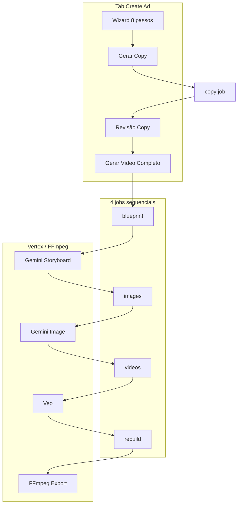

# Ecoom Direct ADS — Estado Actual do Pipeline (documento para auditoria GPT)

> **Propósito:** Documento completo para um LLM analisar falhas, gaps, riscos e melhorias no pipeline de geração de anúncios em vídeo.  
> **Data de referência:** 18 Agosto 2026, ~02:20 UTC+1  
> **Branch:** `main` · **último commit:** `062bda6`  
> **Produção:** https://ecoom-direct-ads.vercel.app

---

## 1. Resumo executivo

**Ecoom Direct ADS → Creative Studio** gera anúncios Direct Response em vídeo (UGC / performance) via Gemini + Veo + FFmpeg.

| Camada | Stack |
|--------|-------|
| Frontend | Static SPA em `web/` (Vercel) |
| API | Express :8787 (VPS Contabo, PM2) |
| IA | Vertex AI — Gemini (copy, storyboard, imagens), Veo 3.1 (vídeo) |
| Áudio PT-PT | ElevenLabs / Google TTS + Sync Labs lip sync (só path `full_ad`) |
| Media | FFmpeg concat, crossfade, mix |

**Estado actual (pós-refactor recente):**
- Wizard de brief em 8 passos → copy → vídeo (fluxo copy-first)
- UI **não usa mais `full_ad` monolítico** — corre 4 jobs sequenciais (mais fiável, progresso visível)
- Fila single-worker com watchdog de jobs presos
- Sync localStorage ↔ API antes de jobs
- UI inspirada Google Flow (grid projectos, dark mode)

**Incidente real documentado (18/08/2026):** Job `55ec31df` (vídeo 15s, PT-BR UGC) ficou **1h+ com UI em 11% "A iniciar..."** mas completou na VPS com 3 cenas. Causa: progresso async não persistido (corrigido em `062bda6`).

---

## 2. Arquitectura de deploy

```
Browser
  → Vercel (ecoom-direct-ads.vercel.app)
      rewrite /api/* , /health → http://169.58.195.244:8787
  → VPS /opt/ecoom-direct-ads (PM2: ecoom-ads-api)
      → Vertex AI / GCS
      → ElevenLabs / Sync Labs (opcional)
      → data/ , output/ , assets/ (disco local, gitignored)
```

| Ficheiro | Função |
|----------|--------|
| `vercel.json` | Static + proxy API |
| `.github/workflows/deploy-vps.yml` | Push `main` → SSH git pull + PM2 restart |
| `.github/workflows/deploy-vercel.yml` | Push `web/` → Vercel (requer `VERCEL_TOKEN`) |
| `ecosystem.config.cjs` | PM2, 1 instância, 1GB RAM |
| `web/config.js` | `ECOOM_API_URL = ""` (same-origin proxy) |

**Deploy manual Vercel (fallback):** `vercel deploy --prod --yes` + `vercel alias set … ecoom-direct-ads.vercel.app`

---

## 3. Fluxos de pipeline (CRÍTICO)

### 3.1 Fluxo UI actual — Create Ad (RECOMENDADO)

**Ficheiros:** `web/js/brief-wizard.js`, `web/js/create-ad.js`, `web/js/prompt-template.js`

```
Wizard (8 passos)
  → Brief compilado (Markdown editável)
  → Job copy (Gemini) — "Gerar Copy"
  → Revisão copy (hook, voiceover, CTA editáveis)
  → "Gerar Vídeo Completo" = 4 jobs sequenciais:
       1. blueprint   (storyboard a partir da copy aprovada)
       2. images       (Gemini Image por cena)
       3. videos       (Veo por cena)
       4. rebuild      (FFmpeg concat → export MP4)
  → Preview via fetchProjectExports → assetFileUrl
```

Implementação: `runJobAndWait()` em `create-ad.js` — cada job espera o anterior via `trackJob()`.

**Tempo esperado:** vídeo ~15s com 2–3 cenas → **5–15 min** (Veo ~2–5 min/cena). UI avisa no hero.

**Limitação:** Este fluxo **não inclui TTS/lipsync PT-PT** — usa áudio nativo Veo (PT-BR OK; PT-PT pode precisar path `full_ad`).

### 3.2 Fluxo faseado manual (tabs)

| Tab | Acção | Job type |
|-----|-------|----------|
| Create | Gerar Copy | `copy` |
| Images | Generate Blueprint | `blueprint` |
| Images | Generate All Images | `images` |
| Videos | Animate All | `videos` |
| Timeline / Export | Rebuild Final Video | `rebuild` |

Mesmo gap PT-PT: rebuild = só concat clips Veo, sem lip sync externo.

### 3.3 Fluxo one-shot `full_ad` (API / CLI)

**Trigger:** `POST /api/jobs` ou `npm run ad`  
**Orquestrador:** `src/run-ad-generation.js`

```
config → copy [skip se approvedCopy]
  → storyboard (generateStoryboardFromCopy)
  → imagens (Gemini Image)
  → vídeo (Veo, Flow UGC multi-cena)
  → voz (TTS PT-PT se UGC + external)
  → lipsync (Sync Labs) ou mix FFmpeg
  → concat → MP4 em output/
```

**Progress steps:** `queued → copy → storyboard → image → video → voice → lipsync → mix → done`

**UI já NÃO chama isto** (desde `062bda6`). API mantém-se para CLI/batch.

**Problema histórico:** UI mostrava 11% horas sem update — `onProgress` não era awaited (corrigido).

---

## 4. Wizard de brief

**8 passos** (`web/js/brief-wizard.js`):

1. Produto  
2. Persona  
3. Objetivo  
4. Estilo + Tom (selects de `/api/config`)  
5. Idioma, variante, formato, resolução  
6. Duração orientativa (texto — IA decide cenas/clip)  
7. CTA  
8. Notas extras  

- **Enter** avança · **Shift+Enter** nova linha  
- Output: `buildMasterPrompt()` → Markdown estruturado  
- Settings extraídos via `wizardToSettings()` → `pickAdOverrides()` no backend  

**Defaults wizard vs config (BUG conhecido):**
- `tone: "natural"` no wizard — **não existe** em `AD_TONES` (`amigavel`, `urgente`, `premium`, `profissional`)
- `resolution: "720p"` no wizard vs default `1080p` em `DEFAULT_AD_CONFIG`

---

## 5. Jobs, fila e progresso

### 5.1 Tipos de job (`server/workers.js`)

| type | Handler | Persiste |
|------|---------|----------|
| `copy` | `runCopyJob` | `latestCopy` |
| `blueprint` | `runBlueprintJob` | blueprint + scenes |
| `full_ad` | `runFullAdJob` | copy, blueprint, job link |
| `images` | `runImagesJob` | image assets/cena |
| `scene_image` | `runSceneImageJob` | versão imagem |
| `videos` | `runVideosJob` | video assets/cena |
| `scene_video` | `runSceneVideoJob` | versão vídeo |
| `rebuild` | `runRebuildJob` | `latestExport` |

### 5.2 Fila (`server/index.js`)

- **Single worker FIFO** — `activeJobId` + `queue[]` em memória  
- Persistência: `data/jobs/{8-char-id}.json`  
- Recovery no arranque: `recoverQueueOnStartup()` → `resetStaleRunningJobs()`  
- **Watchdog** (desde `062bda6`): a cada 60s, se job `running` sem `updatedAt` há >3 min (`JOB_STALE_MS`) → marca `failed`, liberta fila  
- **Reset manual:** `POST /api/queue/reset` → falha job activo, liberta fila  

### 5.3 Progresso UI (`web/js/job-activity.js`)

- Polling 1s  
- Linha principal estilo Cursor: `#ws-job-current`  
- Pipelines por tipo em `PIPELINE_BY_TYPE`  
- Job perdido → erro após 5 polls  

**Fix `062bda6`:** `runAdGeneration` faz `await onProgress(...)` em cada step — progresso persiste no disco.

---

## 6. API — endpoints principais

Base: `server/index.js` · JSON 8MB · CORS `FRONTEND_URL`

### Health & config
- `GET /health` — ok, activeJobId, queueLength  
- `GET /api/config` — languages, tones, styles, maxSceneCount: 150, briefWizard: true  
- `GET /api/queue/status`  
- `POST /api/queue/reset` — **NOVO** liberta fila  

### Projectos
- CRUD `/api/projects/:id`  
- `POST /api/projects/:id/copy` — job copy  
- `POST /api/projects/:id/blueprint` — aceita `approvedCopy`, `wizard`, `overrides`  
- `POST /api/projects/:id/images/generate`  
- `POST /api/projects/:id/videos/generate`  
- `POST /api/projects/:id/timeline/rebuild`  
- Cenas: GET/PATCH, regenerate image/video, activate version  

### Jobs
- `POST /api/jobs` — `full_ad` (overrides limpos via `pickAdOverrides`)  
- `POST /api/jobs/batch` — até 20 briefs  
- `GET /api/jobs/:id`, `/video`, `/copy`  

### Assets
- `GET /api/assets/:id/file`  
- Upload base64 max 6MB  

---

## 7. Modelo de dados

### Projecto (`data/projects/{uuid}.json`)
```json
{
  "id", "name", "masterPrompt", "settings",
  "scenes": [{ "id", "imagePrompt", "motionPrompt", "voiceoverLine",
               "imageAssetId", "videoAssetId", "imageVersions", "videoVersions", "status" }],
  "blueprintPath", "blueprint", "latestCopy", "latestExport",
  "jobIds", "assetIds", "timelineStatus"
}
```

### Job (`data/jobs/{id}.json`)
```json
{
  "id", "type", "status", "progress": { "step", "message", "sceneIndex", "sceneTotal" },
  "request", "result", "error", "updatedAt"
}
```

### Frontend cache
- `localStorage` key `ecoom_projects_v1`  
- `ensureProjectOnServer()` — cria projecto na API se só existir localmente  
- Evento `ecoom:project-synced` → actualiza URL se ID mudar  

### Pastas runtime (gitignored)
| Pasta | Conteúdo |
|-------|----------|
| `data/` | projects, jobs, assets metadata |
| `assets/run-{id}/`, `assets/project-{id}/{jobId}/` | imagens |
| `output/` | MP4s, copy JSON, clips, exports |
| `prompts/storyboard-{id}.json` | storyboards |

---

## 8. Módulos core

| Módulo | Path | Função |
|--------|------|--------|
| Orquestrador | `src/run-ad-generation.js` | Pipeline completo CLI/full_ad |
| Copy | `src/lib/copy-writer.js` | Gemini → copy JSON |
| Storyboard | `src/lib/storyboard.js` | `generateStoryboardFromCopy()` — IA decide cenas + clipDuration |
| Imagens | `src/lib/scene-images.js`, `imagen.js` | Gemini Image |
| Vídeo | `src/lib/scene-videos.js`, `veo-client.js`, `generate-sequence.js` | Veo + Flow chain |
| TTS | `src/lib/tts.js`, `elevenlabs.js`, `google-tts.js` | Só path full_ad PT-PT |
| Lip sync | `src/lib/lipsync.js` | Sync Labs |
| Mix/concat | `src/lib/mix-audio.js`, `concat-videos.js` | FFmpeg |
| Rebuild | `src/lib/timeline-rebuild.js` | Concat só clips (fluxo faseado) |
| Config | `src/lib/ad-config.js` | Limites, resolveAdConfig, max 150 cenas |
| Overrides | `server/ad-overrides.js` | `pickAdOverrides()` — limpa body API |

### Lógica áudio
```
UGC + VEO_GENERATE_AUDIO=true + (não PT-PT OU TTS_ENGINE=veo)
  → Veo native audio no prompt

UGC + PT-PT + external TTS
  → TTS → Sync Labs ou mix FFmpeg  [APENAS full_ad]
```

---

## 9. Frontend — mapa de ficheiros

| Ficheiro | Função |
|----------|--------|
| `web/js/app.js` | Routing hash, grid Flow-style, delete projectos |
| `web/js/create-ad.js` | Wizard, copy, vídeo faseado (`runJobAndWait`) |
| `web/js/brief-wizard.js` | 8 passos, Enter avança |
| `web/js/prompt-template.js` | Brief template + wizardToSettings |
| `web/js/job-activity.js` | Painel progresso Cursor-style |
| `web/js/projects.js` | Cache + `ensureProjectOnServer`, `ensureApiEnabled` |
| `web/js/images.js` | Blueprint, imagens, upload |
| `web/js/videos.js` | Animate All |
| `web/js/timeline.js` | Editor cenas, rebuild |
| `web/js/export.js` | Preview MP4, histórico |
| `web/js/api.js` | Fetch wrappers |

**Tabs placeholder:** Templates, Settings, Account

---

## 10. Variáveis de ambiente (VPS)

Ver `.env.example`. Essenciais:

```env
GOOGLE_CLOUD_PROJECT=
GOOGLE_CLOUD_LOCATION=global
GCS_OUTPUT_URI=gs://bucket/path/
GOOGLE_APPLICATION_CREDENTIALS=/opt/ecoom-direct-ads/gcp-sa.json

VEO_MODEL=veo-3.1-fast-generate-001
VEO_GENERATE_AUDIO=true
GEMINI_STORYBOARD_MODEL=gemini-2.5-flash
GEMINI_IMAGE_MODEL=gemini-3-pro-image

TTS_ENGINE=auto
ELEVENLABS_API_KEY=
SYNC_LABS_API_KEY=

PORT=8787
FRONTEND_URL=https://ecoom-direct-ads.vercel.app
JOB_STALE_MS=180000   # watchdog fila (opcional)
```

---

## 11. Histórico de commits recentes

| Commit | Alteração |
|--------|-----------|
| `062bda6` | Watchdog fila, `POST /api/queue/reset`, progress await, UI vídeo faseado (4 jobs) |
| `374e1ca` | Enter wizard (capture phase) |
| `2fd464b` | `ensureProjectOnServer` — fix "Projecto não encontrado" |
| `eb5faea` | Brief wizard copy-first, delete projectos, UI Flow |
| `66aa245` | Recovery fila jobs no arranque |
| `84c9c4b` | 150 cenas max, painel actividade live |
| `5e5e038` | Tab Export |
| `0fe1155` | Regeneração parcial + versioning |
| `d2cbe74` | Timeline + rebuild FFmpeg |
| `6a45750` | Tab Videos + Animate All |

---

## 12. Diagrama pipeline UI actual



---

## 13. Problemas conhecidos (prioridade para GPT)

### P0 — Críticos

| # | Problema | Detalhe |
|---|----------|---------|
| 1 | **PT-PT sem lip sync no fluxo UI** | Vídeo faseado (Create + tabs) nunca corre TTS/Sync Labs — só `full_ad` API |
| 2 | **Fila single-thread** | 1 job activo; fila bloqueia todos os utilizadores |
| 3 | **Sem autenticação** | API pública; IP VPS em `vercel.json` |
| 4 | **Data ephemeral no VPS** | `data/` gitignored; restart perde projectos se não sync browser |
| 5 | **Watchdog não mata processo hung** | Liberta fila mas worker Node pode continuar em background |

### P1 — Importantes

| # | Problema | Detalhe |
|---|----------|---------|
| 6 | Wizard `tone: "natural"` inválido | Não está em `AD_TONES` |
| 7 | Delete projecto | Remove só JSON; assets/jobs/output órfãos |
| 8 | `full_ad` vs faseado divergem | Dois caminhos, comportamento áudio diferente — confuso |
| 9 | Job ID 8 chars | Risco colisão UUID |
| 10 | Veo sem timeout global | `waitForVideoOperation` poll infinito (15s interval) |
| 11 | Custo/tempo opaco | 15s pedido → 3 cenas × Veo = 10+ min; sem estimativa dinâmica |
| 12 | Duplicate project | Não copia scenes/assets/copy |

### P2 — Menores

| # | Problema |
|---|----------|
| 13 | Templates/Settings/Account placeholder |
| 14 | Library limitada (10 projectos, imagens) |
| 15 | Upload max 6MB |
| 16 | Sync Labs free tier 3/mês |
| 17 | VERCEL_TOKEN GitHub por vezes inválido — deploy manual CLI |

---

## 14. Lições do incidente 55ec31df

| Facto | Valor |
|-------|-------|
| Pedido | Vídeo ~15s, PT-BR UGC, magnésio |
| Copy | `targetDurationSeconds: 15` |
| Cenas geradas | 3 (storyboard decidiu) |
| UI mostrava | 11% "A iniciar..." durante >1h |
| Estado real VPS | Correu e completou (`status: completed`) |
| Vídeo | `output/an-ncio-magn-sio-homem-40-15s--55ec31df.mp4` |
| Causa UI | `onProgress` não awaited → `updatedAt` nunca mudava |
| Fix | `062bda6` + fluxo faseado com steps visíveis |

**Pergunta para GPT:** Porque 3 cenas para 15s? Storyboard prompt calibra mal? Deveria ser 1–2 cenas × 6–8s?

---

## 15. Comandos de diagnóstico live

```bash
curl -s https://ecoom-direct-ads.vercel.app/health
curl -s https://ecoom-direct-ads.vercel.app/api/queue/status
curl -s https://ecoom-direct-ads.vercel.app/api/projects
curl -s https://ecoom-direct-ads.vercel.app/api/jobs
curl -s -X POST https://ecoom-direct-ads.vercel.app/api/queue/reset
curl -s https://ecoom-direct-ads.vercel.app/api/jobs/JOB_ID
```

---

## 16. Mapa de ficheiros

```
ecoom-direct-ads/
├── server/
│   ├── index.js           # API + fila + watchdog
│   ├── workers.js         # Job handlers
│   ├── job-store.js       # Persist jobs + recovery
│   ├── project-store.js   # Projects + applyBlueprint
│   ├── asset-store.js
│   ├── ad-overrides.js    # pickAdOverrides
│   ├── timeline.js
│   └── exports.js
├── src/
│   ├── run-ad-generation.js
│   ├── generate-sequence.js
│   └── lib/               # copy, storyboard, veo, tts, lipsync, ffmpeg...
├── web/
│   ├── index.html
│   ├── styles.css
│   └── js/                # app, create-ad, brief-wizard, job-activity...
├── docs/
│   ├── PIPELINE-AUDIT.md  ← este ficheiro
│   ├── RESUMO-APP.md
│   └── ARQUITETURA-MIGRACAO.md
├── data/                  # runtime VPS (gitignored)
├── vercel.json
└── ecosystem.config.cjs
```

---

## 17. Perguntas para o GPT analisar

1. O fluxo copy-first + 4 jobs sequenciais está coerente? Onde ainda quebra state?
2. Como unificar áudio PT-PT (TTS/lipsync) no fluxo faseado sem duplicar código?
3. O storyboard-from-copy gera demasiadas cenas para vídeos curtos (15s → 3 cenas)?
4. Que timeouts/guardrails faltam antes de gastar créditos Veo?
5. A fila single-worker é adequada? Alternativa (BullMQ, Redis)?
6. Estratégia de persistência: migrar JSON files → Postgres/Supabase?
7. Autenticação mínima viável?
8. Testes automatizados — o que testar primeiro?
9. Prompts Gemini (copy, storyboard, image, motion) — gaps vs brief wizard?
10. Quick wins esta semana vs roadmap 3 meses?

---

## 18. Prompt pronto para colar no GPT

```
Analisa o documento PIPELINE-AUDIT.md do projecto Ecoom Direct ADS (commit 062bda6, 18 Ago 2026).

Contexto: Creative Studio para anúncios vídeo UGC/performance — Gemini + Veo + FFmpeg.
UI actual: wizard brief → copy → 4 jobs (blueprint→images→videos→rebuild).
API mantém full_ad monolítico (com TTS/lipsync PT-PT) mas UI já não usa.

Incidente real: job 55ec31df — UI preso 11% 1h+, VPS completou 3 cenas/15s.

Tarefas:
1. Falhas lógicas no pipeline (especialmente PT-PT áudio, cenas vs duração pedida).
2. Bugs prováveis P0/P1/P2 com fixes concretos (ficheiro + abordagem).
3. Melhorias priorizadas: quick wins (esta semana) vs roadmap.
4. Testes concretos por etapa crítica.
5. Revisão prompts Gemini — calibração duração/cenas.
6. Pontos de falha produção (VPS, fila, GCS, APIs).

Responde em português, estruturado, com tabela de prioridades e estimativa de esforço (S/M/L).
```

---

*Documento actualizado após: wizard copy-first, UI faseada, watchdog fila, sync projectos, fix progresso, UI Flow. Commit HEAD: `062bda6`.*
